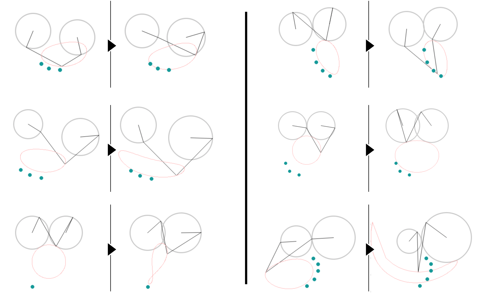

---
# Feel free to add content and custom Front Matter to this file.
# To modify the layout, see https://jekyllrb.com/docs/themes/#overriding-theme-defaults
title: Yuichi Hirose
layout: home
nav_exclude: true
---

**Yuichi Hirose**
{: .fs-5 .lh-0 }
[YouTube](https://www.youtube.com/channel/UCoKSMabXirurhL8UbVTO1JA) /
[Twitter](https://x.com/solidknit/) /
[Google Scholar](https://scholar.google.com/citations?user=e3o8oN0AAAAJ) /
[CV](https://docs.google.com/document/d/1IwtdWoTnUsgF3s5JSIWf494zsNDXmGuDUAnIqA3ucDI/edit?usp=sharing)

I am a PhD student in [Carnegie Mellon University]’s [Robotics Institute], advised by [Jim McCann] in the [Textiles Lab]. My research interest lies in digital fabrication, particularly in *[solid knitting]*, a new fabrication technique to knit dense, volumetric objects, which I invented. I am developing a *[solid knitting machine]* to automate the process.  
Previously, I graduated with a bachelor's and a master's from Keio University Shonan Fujisawa Campus, where I was advised by [Hiroya Tanaka], and worked as a mechanical engineer developing 3D milling machines at [Roland DG].

---

## Research 
### **Solid Knitting** (2024)  
_3D volumetric knitting technique and machine, design tool, and programming language to automate it_  

    <iframe src="https://www.youtube.com/embed/uVRXWlpiyAc?si=3qHagfMogun07uTd&amp;start=5" title="YouTube video player" frameborder="0" allow="accelerometer; autoplay; clipboard-write; encrypted-media; gyroscope; picture-in-picture; web-share" referrerpolicy="strict-origin-when-cross-origin" allowfullscreen></iframe>

Yuichi Hirose, [Mark Gillespie], [Angelica M. Bonilla Fominaya], [James McCann]  
ACM Transactions on Graphics (SIGGRAPH 2024)  
[project page](https://textiles-lab.github.io/publications/2024-solid-knitting/) /
[paper](https://drive.google.com/file/d/1_Ly3i_uj_Tvu1TLCtzh8lTtWGDQMTGD6/view?usp=sharing) /
[doi](https://dl.acm.org/doi/10.1145/3658123)
[Best Paper (Honorable Mention)](https://blog.siggraph.org/2024/06/siggraph-2024-technical-papers-awards-best-papers-honorable-mentions-and-test-of-time.html/){: .label .label-yellow }  
 

    
    

    
    

[solid knitting samples](https://photos.app.goo.gl/vugGd1rNnUvkTyXg7)  
Many of the samples in this album are _hand-knitted_, not by the machine described in the paper. My PhD goal is to enable the machine to knit them.

 

### **Manual NC Plotter** (2013)
_"Drawing music box" that draws when a rack (bar-shaped gear) is inserted_  

    <iframe src="https://www.youtube.com/embed/S1Fd5ZiJzN8?si=WFWLwpNx-U25Xtnk" title="YouTube video player" frameborder="0" allow="accelerometer; autoplay; clipboard-write; encrypted-media; gyroscope; picture-in-picture; web-share" referrerpolicy="strict-origin-when-cross-origin" allowfullscreen></iframe>

Yuichi Hirose, [Hiroya Tanaka]  
ACM SIGGRAPH 2013 Posters  
[doi](https://dl.acm.org/doi/abs/10.1145/2503385.2503435)

---

## Course Projects

### **Linkage Optimizer** (2024)
_Trajectory simulation and optimization of five-bar linkage_

    

[code](https://github.com/yuichirose/linkage-optimizer) /
[paper](https://drive.google.com/file/d/1kLVS_Devlsu2HFekvGNteaaIAGRVHBvL/view?usp=sharing)  
 

### **STL Voxelizer** (2023)
_STL voxelizer using ray casting algorithm and baycentric coordinate system_

    

[code](https://github.com/yuichirose/stl-voxelizer)

---

## Weekend Projects

### **Remote Blocks** (2016)
_Customizable learning remote control_  

    
    

 

### **Remote Volume** (2012)
_Remote control that changes channels when rotated_  

    <iframe src="https://www.youtube.com/embed/cyGHt9RXjCk?si=1iGy7xz2XMIxSgyf" title="YouTube video player" frameborder="0" allow="accelerometer; autoplay; clipboard-write; encrypted-media; gyroscope; picture-in-picture; web-share" referrerpolicy="strict-origin-when-cross-origin" allowfullscreen></iframe>

 

### **Handmade Balans Chair** (2012)
_DIY of the chair I wanted_

    

[how to make](https://www.instructables.com/handmade-balans-chair/)

---

## Patent

- Knitting Machine and Knitting Method (2018)  
_Inventions on the solid knitting machine_  
JP7103557B2 (Japan), PCT/JP2019/051406 (International Application)  
[google patents](https://patents.google.com/patent/JP7103557B2/en)

---

## Grants, Scholarship & Awards

- JASSO Scholarship (2024 - 2027)  
Research funding: 12,816,000 JPY
- INNO-vation Program Disruptive Challenge Section (2018-2019, 2021-2022)  
Research funding: 6,000,000 JPY  
[article](https://innouvators.com/en/article/10242/)  
- S-Booster JAXA Prize (2021)  
[article 1](https://aerospacebiz.jaxa.jp/topics/news/s-booster2021_solidknit/) / 
[article 2](https://global.jaxa.jp/activity/pr/jaxas/no087/04.html) /
[video](https://youtu.be/AI2rZGxZX6g?feature=shared)
- MITOU Advanced Program (2019 - 2020)  
Research funding: 4,567,000 JPY
- Kamoe Art Center Artist-in-residence Program [Artist of the Year](https://kamoeartcenter.org/2019%E5%B9%B4%E5%BA%A6%E3%82%A2%E3%83%BC%E3%83%86%E3%82%A3%E3%82%B9%E3%83%88%E3%83%BB%E3%82%A4%E3%83%B3%E3%83%BB%E3%83%AC%E3%82%B8%E3%83%87%E3%83%B3%E3%82%B9%E8%B3%9E%E5%8F%97%E8%B3%9E%E8%80%85/)

---

## Talks & Exhibition

- Talk at [Tatsuki Hayama] Lab, Keio University SFC (Jan. 2025)  
_Solid Knitting in Digital Fabrication._
- Talk at [Hiroya Tanaka Lab], Keio University SFC (Jun. 2023)  
_Knitting in Digital Fabrication._
- Talk at [AxLab], The University of Chicago (Oct. 2022)  
_Solid Knitting Machine - Machine Which Makes Physical Objects Updatable._
- Online talk at Dassault Systèmes [3DEXPERIENCE World] (Feb. 2021)  
_Solid Knitting Machine - Machine Which Makes Physical Objects Updatable._  
[video](https://youtu.be/vWMN-c_F3-o?feature=shared)
- Online talk for Japán Alapítvány Budapest (Japan Foundation, Budapest) (Jan. 2021)  
_Solid Knitting Machine - Machine Which Makes Physical Objects Updatable._  
[video 1](https://youtu.be/pzuz-kbLf-A?feature=shared) / 
[video 2](https://youtu.be/28eE2mS_L6c?feature=shared)
- Talk at FabLab SENDAI – FLAT (as part of the Sendai Mediatheque Art Node Program) (Dec. 2020)  
_完成させる必要のないものづくり (Making that doesn’t need to be completed)._  
[article](https://artnode.smt.jp/report/20210218_8511) /
[video](https://youtu.be/2CsGIsIlWxA?feature=shared)
- Talk and Exhibition at Kamoe Art Center (Nov. 2020)  
_ソリッド・ニッティング・マシン 物体を更新可能にする機械 (Solid Knitting Machine - Machine Which Makes Physical Objects Updatable)._
- Talk and Workshop at Kamoe Art Center (Aug. 2019)  
_Bits and Loops 立体を編む (Bits and Loops: Knit Solid Objects)._  
[article](https://kamoeartcenter.org/bits-and-loops-%E7%AB%8B%E4%BD%93%E3%82%92%E7%B7%A8%E3%82%80/)

---

## Miscellanea

- [Weekly report](https://fab.cba.mit.edu/classes/865.24/people/yuichi/index.html) for [Rapid-Prototyping of Rapid-Prototyping Machines](https://fab.cba.mit.edu/classes/865.24/index.html) (2024)  
@ MIT's Center for Bits and Atoms (Remotely attended)
- [3D milling machine MDX-540 manual](https://drive.google.com/drive/folders/1vtK3bPS4X6LF1pSbqPy-iAu4DMsUPIQY?usp=drive_link) (2021)
- [板金設計講座 (Introduction to sheet metal design)](https://scrapbox.io/Solidknit/%E6%9D%BF%E9%87%91%E8%A8%AD%E8%A8%88%E8%AC%9B%E5%BA%A7) (2021)
- [Weekly report](https://fabacademy.org/2013/students/yuichi.hirose/index.html) for [Fab Academy](https://fabacademy.org/) (2013)

[Carnegie Mellon University]: https://www.cs.cmu.edu/
[Robotics Institute]: https://www.ri.cmu.edu/
[Jim McCann]: https://www.cs.cmu.edu/~jmccann/
[Textiles Lab]: https://textiles-lab.github.io/
[solid knitting]: https://textiles-lab.github.io/publications/2024-solid-knitting/
[solid knitting machine]: https://textiles-lab.github.io/publications/2024-solid-knitting/
[Hiroya Tanaka]: https://fab.sfc.keio.ac.jp/about.html
[Roland DG]: https://www.rolanddg.co.jp/
[Mark Gillespie]: https://markjgillespie.com/
[Angelica M. Bonilla Fominaya]: https://abfominaya.com/
[James McCann]: https://www.cs.cmu.edu/~jmccann/
[Tatsuki Hayama]: https://tomoe.me/
[Hiroya Tanaka Lab]: https://fab.sfc.keio.ac.jp/
[AxLab]: https://www.axlab.cs.uchicago.edu/
[3DEXPERIENCE World]: https://blogs.solidworks.com/teacher/2021/05/a-virtual-maker-world-with-the-3dexperience-lab.html
